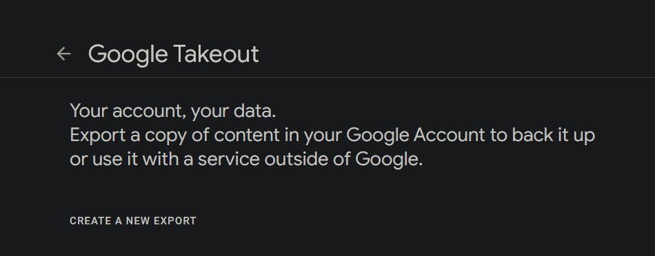
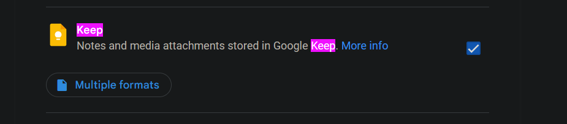
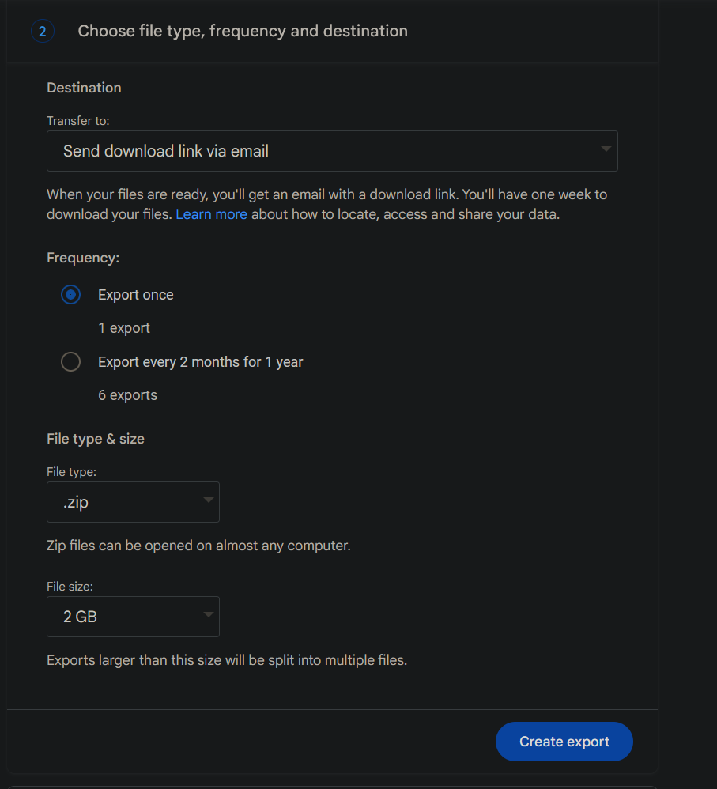
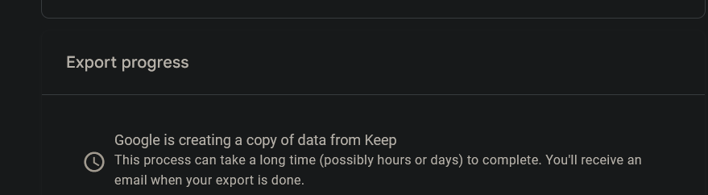
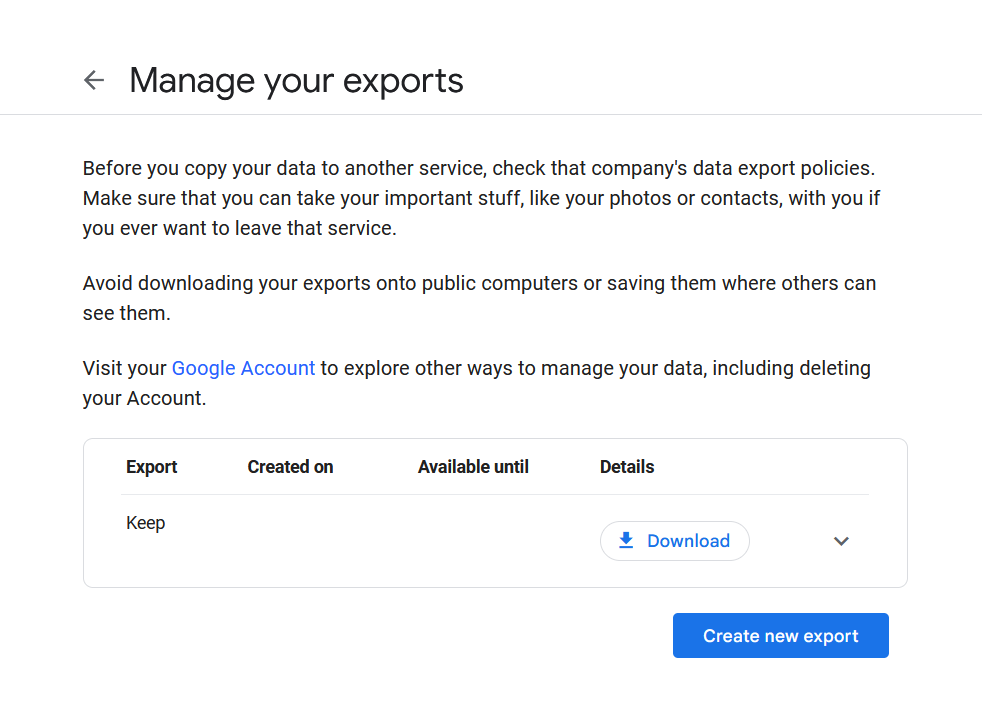

# Keep Python Markdown Takeout Google

## Description

## Steps

- Visit `https://takeout.google.com/settings/takeout`

- Only select `Keep`

- Select `Export once` for frequency

- Wait for the export to finish

- When ready, visit link and download

